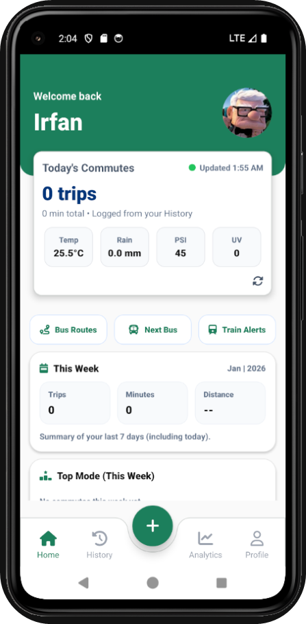
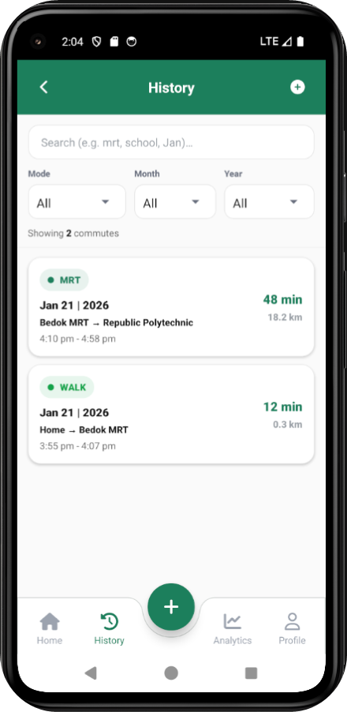
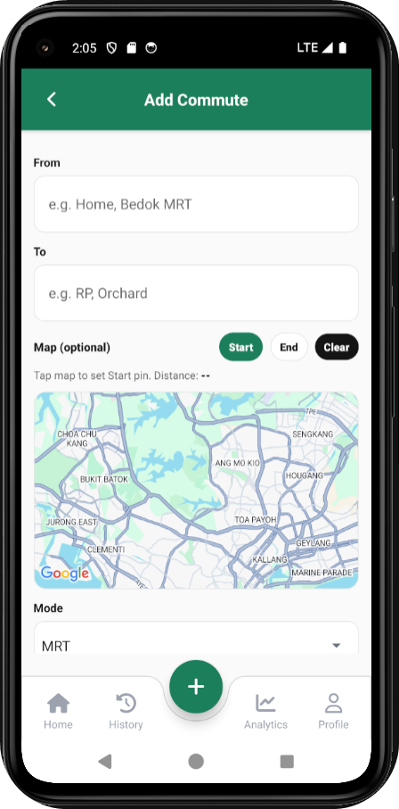

# EcoCommute 🌿🚌

A simple mobile app that helps users track their daily commutes and view useful public transport info like **bus arrivals**, **bus routes**, and **train service alerts**.

Built with **React Native (Expo)** + a backend API.

Link to server Repo: https://github.com/peatergripin/C346-CA2-Server

---

## ✅ Features

- 🏠 Home dashboard (weekly stats + recent commutes)
- 📜 Commute history (search + filter by mode/month/year)
- 🚌 Next bus arrival timings (auto refresh + pull to refresh)
- 🗺️ Bus routes lookup (stops + weekday/weekend timing)
- 🚆 Train service alerts (live LTA DataMall status)
- 👤 User login/register + profile editing (avatar upload supported)

---

## 🛠️ Tech Stack

- **Frontend:** React Native + Expo
- **Backend:** Node.js + Express (example)
- **Storage:** AsyncStorage
- **APIs:** LTA DataMall (Bus + Train data)

---

## 🧭 App Routes / Navigation

| Screen Name    | Route Key           | Purpose                           |
| -------------- | ------------------- | --------------------------------- |
| Home           | `Home`              | Shows dashboard and quick actions |
| History        | `History`           | List + search + filter commutes   |
| Commute Detail | `CommuteDetail`     | View single commute details       |
| Add Commute    | `AddCommute`        | Add a new commute record          |
| Edit Commute   | `EditCommute`       | Edit an existing commute          |
| Next Bus       | `NextBus`           | Bus arrival timings by stop code  |
| Bus Routes     | `BusRoutes`         | View bus service route stops      |
| Train Alerts   | `TrainServiceAlert` | Live MRT/LRT disruption alerts    |
| Profile        | `Profile`           | Account profile + logout          |
| Login          | `Login`             | Login screen                      |
| Register       | `Register`          | Account creation screen           |

---

## Screenshots of the mobile app

The screenshots below showcase the key screens of the mobile application.

<table>
  <tr>
    <td align="center">
       
      Login
    </td>
    <td align="center">
       
      Home
    </td>
    <td align="center">
       
      Add Commute
    </td>
    <td align="center">
       
      Overall Flow
    </td>
  </tr>
</table>

## Video walkthrough of the app

A short video demonstrating the features and flow of the application:  
https://youtu.be/OsnKArMhWfU

---

## Team Contributions

As this is a team project, each member’s role and contributions are documented below. Refer to the documentations for greater details.

| Name  | Role               | Responsibilities |
| ----- | ------------------ | ---------------- |
| Irfan | Frontend Developer | React Native App |
| Randy | Backend Developer  | Web Service      |

---
